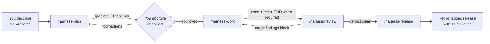
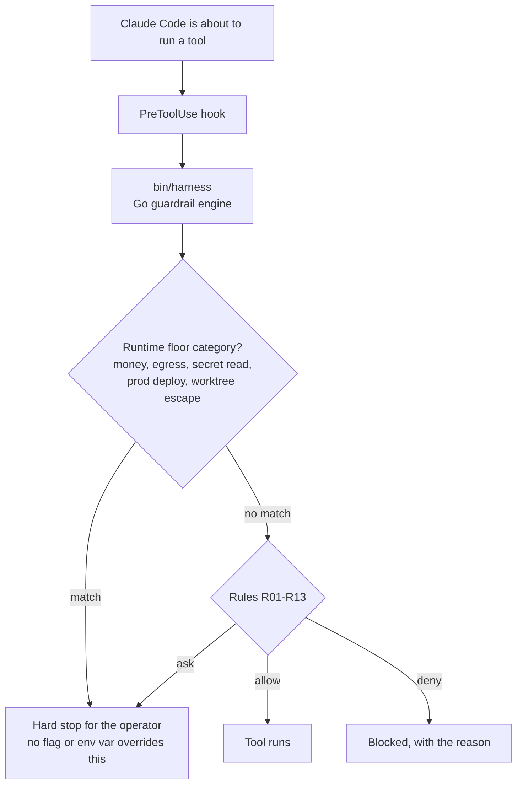
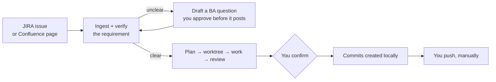

# Harness

<p align="center">
  <strong>Plan. Work. Review. Ship.</strong><br>
  <em>A disciplined delivery loop for Claude Code.</em>
</p>

<p align="center">
  <a href="https://github.com/foden303/harness/releases/latest"></a>
  <a href="LICENSE.md"></a>
  <a href="docs/CLAUDE_CODE_COMPATIBILITY.md"></a>
  
  
</p>

Claude Code is powerful, but raw agent work drifts: plans live in chat, tests
become optional, review happens too late, and release evidence gets rebuilt by
memory. Harness turns that into one repeatable operating path.



After install, the default changes from "ask the agent to code" to:

1. write the spec and plan,
2. implement only the approved slice,
3. verify the result,
4. review independently,
5. package evidence for PR or release.

**Claims in this README are machine-checked against the code.** CI gates verify that
implemented components are actually wired (no dead code claimed as done), that the task
ledger's dependencies stay consistent, and that the shipped binaries rebuild from source.
A feature is described here only after a gate proves it is reachable — "written" is not
"working."

## Quickstart

New users should start from the tool they already use. Existing users should
run the migration report before cleanup or reinstall.

| Path | Start |
|---|---|
| New user | [Tool-first onboarding](docs/onboarding/index.md) |
| Existing user | [Migration check](docs/onboarding/migration.md) |
| Claude Code fast path | [Install in 30 seconds](#install-in-30-seconds) |
| Trigger proof | [Skill trigger gate](docs/onboarding/skill-trigger-acceptance.md) |

## Install in 30 Seconds

```bash
claude
/plugin marketplace add foden303/harness
/plugin install harness@harness-marketplace
/harness-setup
```

Next command: run `/harness-plan` with one small request.

```bash
/harness-plan Improve the README onboarding flow
```

## First 15 Minutes

1. Install through your tool route.
2. Run `/harness-setup` or the equivalent setup script.
3. Run `/harness-plan` with a small request; Harness writes the `spec.md` and
   `Plans.md` drafts for you to check. Small typo, docs, and status updates stay
   lightweight.
4. Approve the generated contract or reply with the correction you want.
5. Run the smallest approved task, for example `/harness-work 1.1.1`.
6. Run `/harness-review` and keep the verification output.

Your job is not to hand-write the plan. It is to approve or correct the
generated contract before execution continues.

## How It Works

Harness adds a source-of-truth loop around agent work.
The 5 verb skills keep that surface small: plan, work, review, sync, release.

1. You describe the outcome in normal language.
2. `/harness-plan` drafts or updates `spec.md` and `Plans.md` with scope,
   acceptance criteria, unknowns, and stop conditions.
3. Non-trivial planning records `team_validation_mode` and validates the plan
   through team/sub-agent or manual-pass perspectives for spec/Plans alignment,
   memory reuse, product fit, security fit, and works-in-practice.
4. Harness treats those files as the source of truth. Data the agent has not
   seen stays `unknown` instead of being silently invented.
5. `/harness-work` implements the approved slice with TDD and verification.
6. `/harness-review` separates review from implementation.
7. `/harness-release` packages only verified evidence.

### What stops a bad tool call

The loop above is the happy path. Underneath it, a Go engine adjudicates every
tool call through Claude Code's native hooks — independent of what the model
decides it wants to do.



There is no approval-skip path: every risk gate, external send, and review
approval reaches you.

## Commands

| Command | What happens inside |
|---------|---------------------|
| `/harness-setup` | Installs project guidance, command surfaces, hooks, and checks so the workflow starts from one known baseline. |
| `/harness-plan` | Turns intent into `spec.md` and `Plans.md`, including scope, acceptance criteria, dependencies, unknowns, stop conditions, and non-trivial planning validation. |
| `/harness-work` | Executes one approved task or range, adds tests when required, runs verification, and keeps work inside the plan. |
| `/harness-work all` | Runs the approved plan through implementation and review paths; use after the plan is clear and the repo baseline is known. |
| `/harness-review` | Reviews the result separately from implementation and treats major findings as blockers. |
| `/harness-release` | Checks release readiness, CHANGELOG/tag boundaries, and evidence packaging after implementation and review are complete. |
| `bin/harness doctor --migration-report` | Inventories old plugin caches, symlinks, and memory state without deleting data. |

## Ticket & Bug Intake

Two orchestration skills take a JIRA/Confluence item all the way to a committed
(never pushed) change, reusing the plan/work/review loop above. Both draft every
external write (ticket comments, transitions) and post only after you approve,
and both create commits while you push manually.



| Skill | Flow |
|-------|------|
| `/harness-flow <ISSUE-KEY\|url ...>` | Ingest a requirement → verify → ask the BA back via a ticket comment when unclear → plan → worktree → work → review → you confirm → commit. Passing several links treats them as one merged feature. |
| `/harness-bugfix <BUG-KEY ...>` | Ingest a bug → triage against the current source → comment QA when it is not a bug, or worktree-fix a real one → review → you confirm → commit. Multiple bugs run one at a time, pausing after each for you to push, so the next starts from an up-to-date base. |

JIRA/Confluence access uses the Atlassian MCP; an absent MCP is reported, not
guessed around.

## Basic Workflow

| Stage | Output | Gate |
|-------|--------|------|
| Investigate | Evidence and unknowns | Do not promote unobserved data into claims. |
| Plan | `spec.md` + `Plans.md` | User approves or corrects the generated contract. |
| Work | Code and tests | TDD required when the task says so. |
| Review | Independent verdict | Major findings block completion. |
| PR | Evidence pack | PR ready is not release ready. |
| Release | Tag/release artifacts | Release preflight must pass on the release path. |

### Non-engineer decision surfaces

Three single-screen HTML views surface the decision at each phase, so a non-engineer
sponsor can judge without reading code:

- **Plan Brief** (`harness-plan-brief`) — understanding, options, risks, and acceptance
  criteria before implementation. Offered when a plan is finalized.
- **Progress** (`harness-progress`) — WIP/TODO/done counts and drift alerts during work.
  Auto-regenerated on a PostToolUse hook.
- **Acceptance** (`harness-accept`) — per-criterion pass/fail with a ship/wait/reject
  recommendation before release.

## Install By Tool

| Tool | Tier | Route |
|---|---|---|
| Claude Code | `supported` | Claude plugin marketplace, then `/harness-setup`. |

Harness supports one host. Other CLIs carried `candidate` /
`future/unsupported` entries before v1.0.0; those claims were removed along
with the research behind them, and none will return without its own bootstrap,
runtime, and release evidence.

## Existing User Migration

Run `bin/harness doctor --migration-report` before changing an existing setup.
The report inventories stale Claude plugin caches, old symlinks, and
harness-mem state without deleting anything.

## Support Boundary

Harness can describe candidate paths, but it does not inherit support claims
from Superpowers, Hermes Agent, or any other project. A host only moves up when
Harness has its own bootstrap, trigger, runtime, and release evidence.

`not_observed != absent`: missing local proof means "not proven here", not
"impossible" and not "supported".

## Requirements

- Claude Code v2.1+ for the supported Claude path.
- A project repository with write access for local setup.
- No Node.js is required for the Go-native guardrail engine.
- Optional [harness-mem](https://github.com/foden303/harness-mem) for
  cross-session memory when configured and healthy.

## Advanced

Use these after the basic trigger path is visible.

| Capability | What it adds | Boundary |
|------------|--------------|----------|
| Breezing | Planner/Critic/Worker style team execution for larger task lists. | Still gated by plan quality and review. |
| harness-mem | Project-scoped memory and recall across sessions. | Optional companion; purge remains explicit. |
| harness-flow | Takes a JIRA issue or Confluence page from requirement to committed change. | Harness commits; the operator pushes. Every external write needs approval. |

## Documentation

| Resource | Description |
|----------|-------------|
| [Tool-first onboarding](docs/onboarding/index.md) | Where to start by host tool. |
| [Install routes](docs/onboarding/install.md) | Per-tool setup and support-tier boundaries. |
| [Migration check](docs/onboarding/migration.md) | Existing-user impact, compatibility, and rollback path. |
| [Skill trigger gate](docs/onboarding/skill-trigger-acceptance.md) | How install success is verified. |
| [Capability matrix](docs/tool-capability-matrix.md) | Supported, internal-compatible, candidate, and unsupported host claims. |
| [Claude Code Compatibility](docs/CLAUDE_CODE_COMPATIBILITY.md) | Current Claude Code requirements and compatibility notes. |
| [Distribution Scope](docs/distribution-scope.md) | Included vs compatibility vs development-only paths. |
| [Hardening parity](docs/hardening-parity.md) | Runtime safety enforcement across hooks and the guardrail engine. |
| [Skills architecture diagram](docs/diagrams/skills-architecture.drawio) | Editable draw.io map of the Plan→Work→Review→Release loop, skills, agents, and the Go engine. |
| [Work All Evidence Pack](docs/evidence/work-all.md) | Success/failure verification contract for full-plan execution. |
| [Changelog](CHANGELOG.md) | User-facing version history. |

## Contributing

Issues and PRs welcome. Read `CLAUDE.md` for the development rules this repo
holds itself to — conventional commits, the CHANGELOG format, and the test
quality rules under `.claude/rules/`.

## Acknowledgments

- [AI Masao](https://note.com/masa_wunder) - Hierarchical skill design
- [Beagle](https://github.com/beagleworks) - Test tampering prevention patterns

## License

MIT License. See [LICENSE.md](LICENSE.md).
