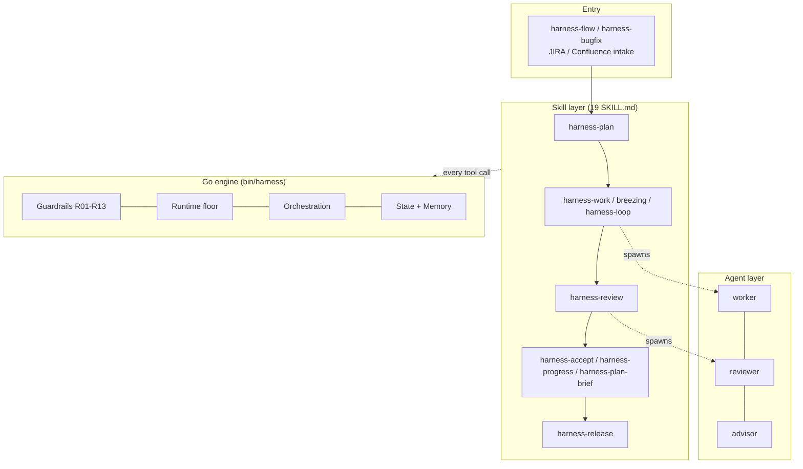

# Harness Architecture

## 1. Overview

`harness` is a plugin that wraps Claude Code in a
disciplined **Plan → Work → Review → Release** loop. The agent no longer codes
straight from chat: intent is written to `spec.md` / `Plans.md`, work happens on
the approved slice, review is independent, and only verified evidence ships.

Two properties define the design:

- **Human keeps the judgment.** The agent prepares plans, diffs, reviews, and
  evidence; the operator approves. The harness **commits but never pushes**, and
  every external write (JIRA/Confluence comment, transition, release publish)
  needs explicit approval.
- **Hook-based enforcement.** The policy engine and workflow run from Claude
  Code through native hooks — one policy, enforced on every tool call.

A visual map is in [`diagrams/skills-architecture.drawio`](diagrams/skills-architecture.drawio)
(editable on app.diagrams.net).

## 2. Layers



- **Skill layer** — self-contained `SKILL.md` units with a `description`
  (auto-discovery trigger) and `allowed-tools`. The five core verbs are
  **plan, work, review, sync, release**; the rest are entry, acceptance, and
  infrastructure skills.
- **Agent layer** — three sub-agents spawned by the skills: `worker`
  (implements in a git worktree), `reviewer` (judges only, read-only), `advisor`
  (consulted when a worker is stuck).
- **Go engine** (`bin/harness`) — the enforcement and orchestration core,
  written in Go so no Node.js runtime is required. It runs on every tool call
  via hooks.

## 3. Directory Structure

```
harness/
├── .claude-plugin/         # Plugin manifest + hooks.json (Claude host)
├── skills/                 # SKILL.md + references/ (SSOT for skills)
├── agents/                 # worker.md / reviewer.md / advisor.md
├── go/                     # Go engine (cmd/harness + internal/*)
├── scripts/                # Shell automation (routing, companions, CI)
├── templates/              # Schemas, config templates, registries
├── docs/                   # Documentation (this file, onboarding, policies)
└── .harness.config.yaml    # Project config (protected paths, model routing)
```

## 4. Key Components

### 4.1 Skills

Skills are the primary surface. Each declares when it should load and which
tools it may use. Heavy skills delegate to sub-agents through the Task tool;
`harness-flow` and `harness-bugfix` are thin orchestrators that reuse the
plan/work/review stages to take a JIRA/Confluence item to a committed fix.

### 4.2 Guardrails (Go policy engine)

Rules **R01–R13** are enforced pre-tool and cannot be bypassed by `setMode`:
force-push (R06), git bypass flags (R10), `reset --hard` on a protected branch
(R11), and direct push to a protected branch (R12) are denied or gated. A
five-category **runtime floor** (money, external send, secret read, deploy,
destruction) always stops. Details in `go/internal/policy/rules.go`.

### 4.3 Hooks

`hooks.json` wires the engine into host events:
- **SessionStart** — session/state bootstrap and health checks.
- **PreToolUse** — the R01–R13 policy gate.
- **PostToolUse** — change tracking, test signals, mirror/drift checks.
- **Stop** — review-gate and summary evaluation.

### 4.4 Orchestration

`harness-work` auto-selects topology by task count (1 = Solo, 2–3 = Parallel,
4+ = Breezing). Breezing runs a Lead → Worker×N → Reviewer team over a
dependency graph, each worker isolated in a `.harness-worktrees/` worktree, with
a review→iterate loop before cherry-picking approved work onto the trunk.

### 4.5 State & Memory

Session/task state lives in SQLite and `.claude/state/*.json|jsonl` (contracts,
review results, ledgers, flow sessions). Optional `harness-mem` adds
project-scoped recall across sessions when configured and healthy.
