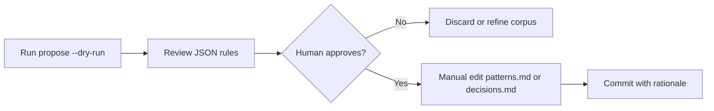

# Failure Codifier — SSOT Promotion Workflow

Phase 100 human-approval gate. **human-approval-required** at every promotion step.

## Overview

Failure Codifier extracts recurring failure signatures from:

1. **Orchestration ledger** (`.claude/state/orchestration-ledger.jsonl`) — breezing companion failures (`exit_code != 0`, `companion-result` with `counts=false`)
2. **Judgment Ledger** (`.claude/state/judgment-ledger.jsonl`) — negative human judgments (`reject` / `stop` / `wait` answers or `failure` tags)

Output is `failure-rule.v1` JSON — **proposal only**.

## Confidence scoring

| Occurrence count | Confidence |
|------------------|------------|
| 1–2 | `low` |
| **≥ 3** | `medium` |
| **≥ 5** | `high` |

Threshold literals live in `go/internal/failurecodifier/confidence.go` (`ConfidenceThresholdMedium = 3`, `ConfidenceThresholdHigh = 5`).

## Proposed SSOT target heuristic

| Signal | `proposed_ssot_target` |
|--------|------------------------|
| Recurring operational / companion / breezing failures | `patterns.md` |
| Human judgment rejections / architectural decisions | `decisions.md` |

The codifier **never writes** these files. It only sets `proposed_ssot_target` on the JSON proposal.

## Promotion workflow (human only)



### Step 1 — Generate proposals

```bash
./scripts/failure-codifier-propose.sh --dry-run
```

### Step 2 — Human review checklist

- [ ] `evidence_refs` trace back to real ledger lines
- [ ] `confidence` matches occurrence count (3/5 thresholds)
- [ ] `proposed_ssot_target` is appropriate (pattern vs decision)
- [ ] No duplicate of existing SSOT content

### Step 3 — Manual SSOT edit (Lead / human)

After approval, edit `.claude/memory/patterns.md` or `.claude/memory/decisions.md` **manually**. Do not use `Promote()` or `AutoPromote()` — both return `ErrAutoPromotionForbidden`.

## Auto-promotion guard

`go/internal/failurecodifier/promote.go`:

- `AutoPromote()` → always error
- `Promote()` without `HumanApproved` → error
- `Promote()` with `DryRun` → error
- Even with `HumanApproved=true` and `DryRun=false`, codifier **still returns error** (proposal-only package)

## Related artifacts

- Schema: `templates/schemas/failure-rule.v1.json`
- Skill: `skills/failure-codifier/SKILL.md`
- Tests: `go/internal/failurecodifier/*_test.go`
